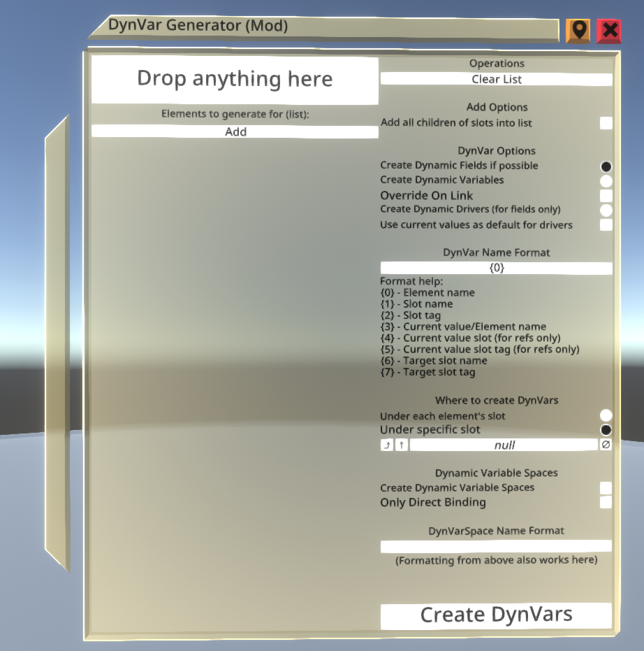

# DynVar Generator

A [ResoniteModLoader](https://github.com/resonite-modding-group/ResoniteModLoader) mod for [Resonite](https://resonite.com/) that adds a wizard to quickly generate huge amounts of dynamic fields/variables/drivers for slots, blend shapes, bones or anything else

## Installation
1. Install [ResoniteModLoader](https://github.com/resonite-modding-group/ResoniteModLoader).
2. Place [DynVarGenerator.dll](https://github.com/TheJebForge/DynVarGenerator/releases/latest/download/DynVarGenerator.dll) into your `rml_mods` folder. This folder should be at `C:\Program Files (x86)\Steam\steamapps\common\Resonite\rml_mods` for a default install. You can create it if it's missing, or if you launch the game once with NeosModLoader installed it will create the folder for you.
3. Start the game. If you want to verify that the mod is working you can check your Resonite logs.

## How to use this mod
Wizard can be found in DevTool's Create New -> Editor -> DynVar Generator. 

**You should also read the information below the image, because that's where the mod gets explained**

Panel on left is list of elements that dynamic vars will be generated for. The drop target accepts any world element. Dropping lists into the target will add all elements of the lists.

You might need [this](https://github.com/TheJebForge/ResoniteMoreReferenceProxies) mod to actually be able to grab lists

If "Add all children" is checked, dropping a slot into the drop target will add all children of the slot as well

## Explanation of the options
- ### Clear List
  Clears all the references in the list
- ### Add all children of slots into list
  When on, if slot reference is dropped into the drop target (The thing that says "Drop anything here") - all children of the slot will be also added to the list
- ### Create Dynamic Fields if possible
  Dynamic Fields will be created for the elements in the list if that's possible. Dynamic Fields need a field reference to be their source, so this will only work if the element is a field. If it's not a field, Dynamic Variable will be created instead (see right below)
- ### Create Dynamic Variables
  Dynamic Variables will be created for the elements in the list. If element is a field, value of the field will be used for value of the DynVar. If element is anything else, reference of the element will be used as value of the DynVar
- ### Reference the field instead
  When enabled, overrides behavior of Create Dynamic Variables in a way that, if element is a field, type of the DynVar will be type of the field and value of the variable will be reference to the field.
- ### Override On Link
  When enabled, leaves override on link parameter as checked on for Dynamic Fields and Dynamic Variables
- ### Create Dynamic Drivers
  Will only work if the element is a field, otherwise the element gets ignored. Creates Dynamic Driver fit for the field, making it drive the field
- ### Use current values as default for drivers
  Adds to Dynamic Driver behavior where default value of the driver is set to current value of the field
- ### Create Dynamically driven ValueCopies
  A peculiar mode where DynamicReferenceDriver and RefCopy/ValueCopy is created. So instead of Dynamic Driver driving the field directly, ValueCopy does the driving while Dynamic Reference Driver provides a reference to a field for Source of the Copy 
    
  Intended to be used in combination with Dynamic Variables that were created with "Reference the field instead" checked on
- ### Write Back
  If write back should be enabled on ValueCopy/ReferenceCopy components that will be generated as part of Dynamically driven ValueCopies 

## What's the difference between Dynamic Drivers and Dynamically driven Value Copies?
Dynamic variables frankly always sync, if you're driving a dynamic variable with a local value, this will sync to everyone else too. So if you have a blink blendshape that's driven by a EyeLinearDriver, and that in addition is inside of a Dynamic Field, so you can have the blendshape synced between multiple meshes. EyeLinear has its own timer for every user which is local, so blinks happen in a desynced manner because it's local. But when you force the blendshape to sync between users using a dynamic variable, it makes everyone's blink get synced. So you'll see double blinking if there's 2 users in the session, because their EyeLinearDrivers blink in different phase, but because of dynamic variables, this gets synced between the users.

However, if you use dynamic variables to only sync the reference to the blendshape, and then use ValueCopy to copy the value of the blendshapes, the value remains local and only the reference of the blendshape gets synced with dynamic variables. Making you be able to have working blinking blendshape across multiple meshes, without the issue of dynamic variables syncing

## Explanation of the format
- ### Element name
  - Slot name if the element is a slot
  - Field name if element is a field
  - Index if element is a field of a list
  - Blend shape name if element is a blend shape under SkinnedMeshRenderer
- ### Slot name
  - Name of parent slot if element is a slot
  - Name of the slot that the component is under if element is a field
- ### Slot tag
  - Tag of the slot that was gathered from above
- ### Current value/Element name
  - Value of the field (eg. int for fields that hold integers, slot name for fields that hold slots)
  - Empty for anything else that is not a field
- ### Current value slot
  - Slot name of the value (eg. name of the slot that holds the material)
  - Name of parent if field holds a slot reference
  - Empty for anything else that is not a field
- ### Current value slot tag
  - Tag of the slot that was gathered from above
- ### Target slot name
  - Slot name of where the dyn vars will be created (either on each element's slot, or specified slot)
- ### Target slot tag
  - Tag of the target slot
